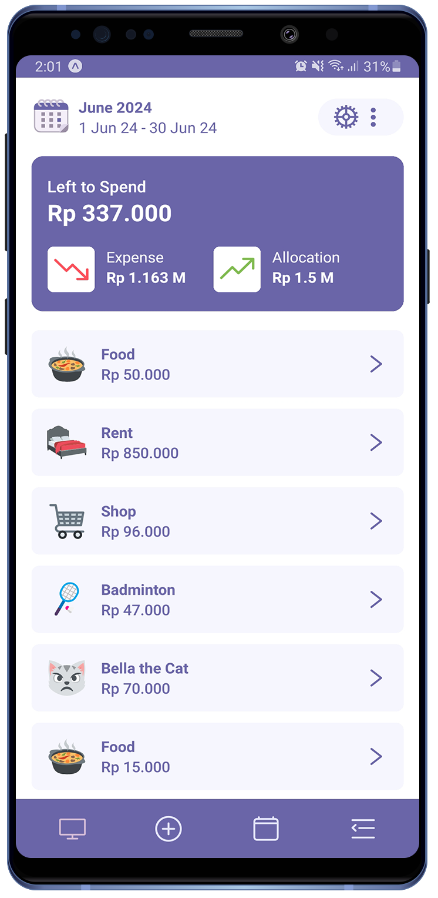
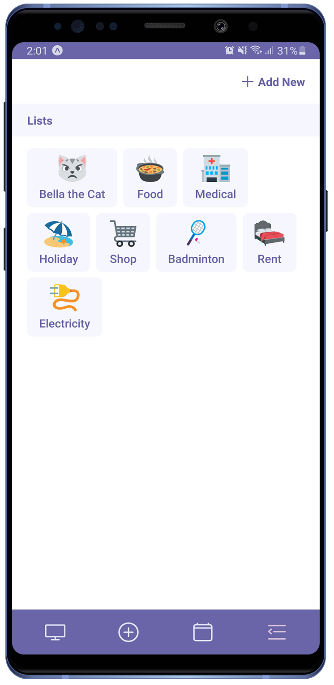
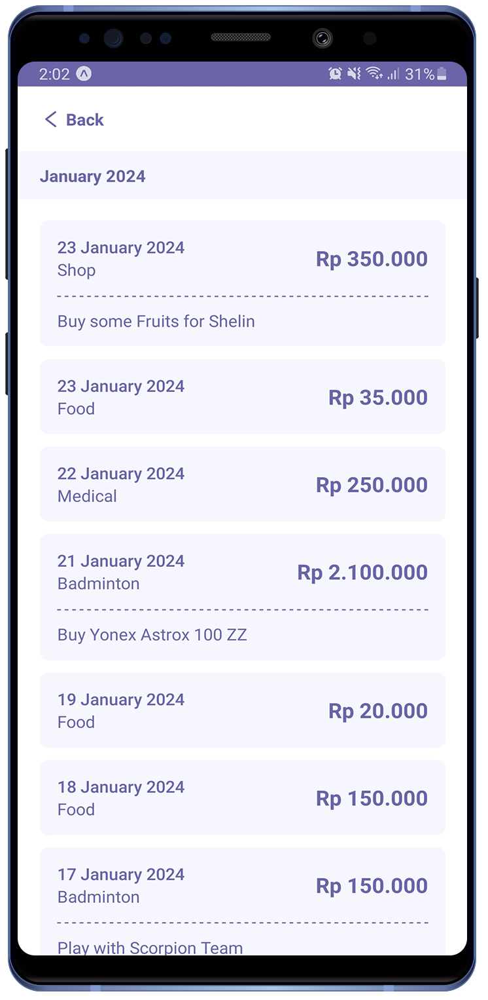

## Introduction

Created with React Native and Expo. It help users to track daily spending habits and get a detailed view of the monthly expenses.

## Features

- Data is saved on SQLite database, ensuring that the information is safe and accessible offline.
- Spending history data can be exported to CSV File.
- AsyncStorage to keep some key-value persistently.
- Quickly and easily add new spending entries to keep the records up-to-date.
- View spending history and get detailed information based on dates.

## Prerequisites

- Node 18.16.0 (LTS)
- Expo SDK 51.0.14

 

## Snippet

